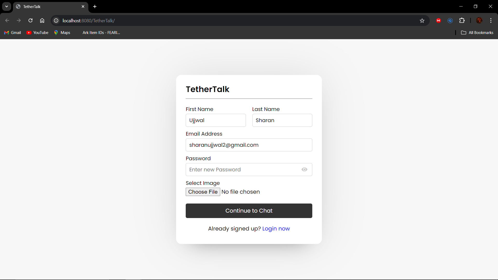
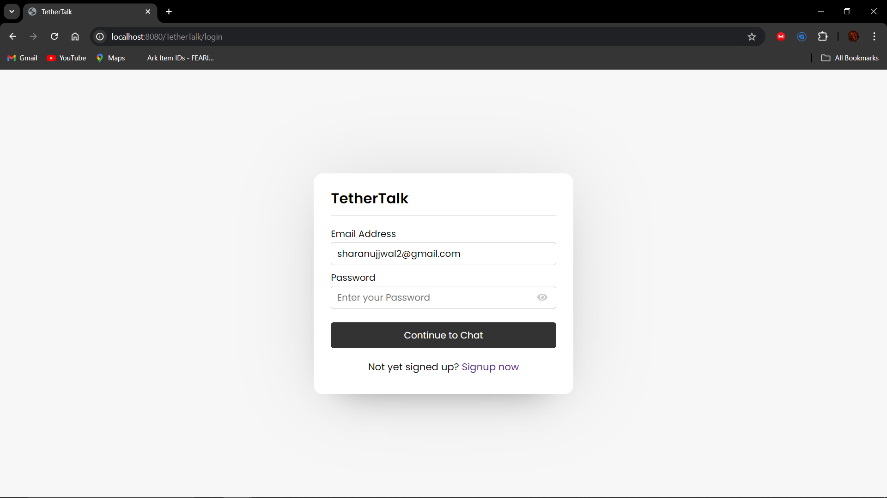
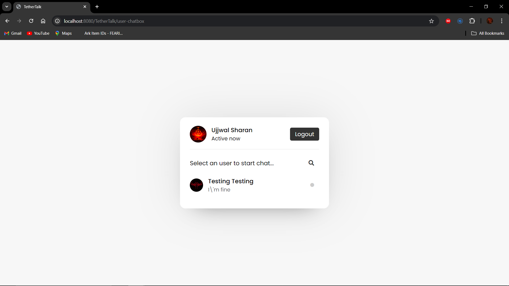
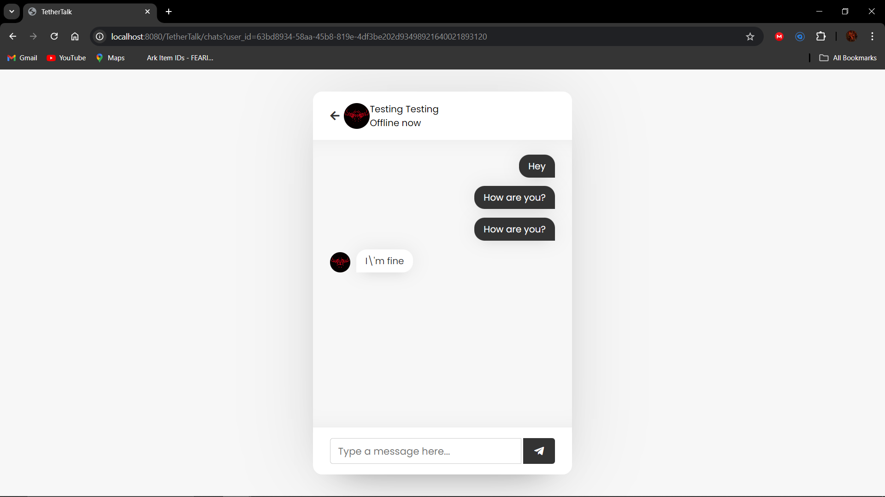

# TetherTalk Application

A web based chat application created in java using Servlet, JSP, HTML, CSS, JavaScript, MySQL and Apache Tomcat 10 Web Server.  

Technologies Used:
  1. HTML, CSS, JavaScript
  2. Servlet
  3. JSP
  4. MySQL
  5. Apache Tomcat-10 Web Server
  6. Created in IntelliJ IDEA Community Edition IDE

Screenshots:

    

        
        
    

    

        
        
    

 

